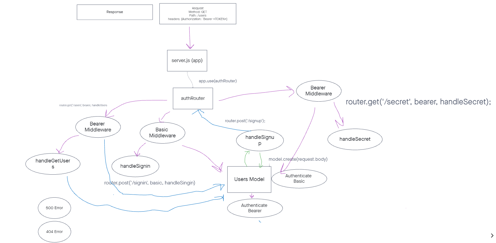

# auth-api
## Live Deploy
[Heroku](https://amy401-authapi.herokuapp.com/)
## Deployment
How do I install the app or library?
Clone this app and install all dependencies.
How do I test the app or library?
Run "NPM test" in the terminal once all dependencies are installed.
For Applications:
How do I run the app?
You can run the app on your local terminal.
You can also test routes on thunder client.
How do I set up the app?
Be sure to install all dependencies. You can publish through heroku.
## Testing
Write a complete set of tests for all functional units and modules
Your tests must be running green on Github Actions
[TESTS](./__tests__)
- Run "npm test" in the terminal to test routes.
You can also test these routes in thunder client:
- /signup
- /signin
- /users
- /secret
## Documentation
Compose a UML or Process/Data Flow Diagram for every application
UML Reference

This should be the first thing you do when beginning work on a lab assignment.
Draw the process/data flow of your application and map it to the code you will need to write or evaluate/fix.

